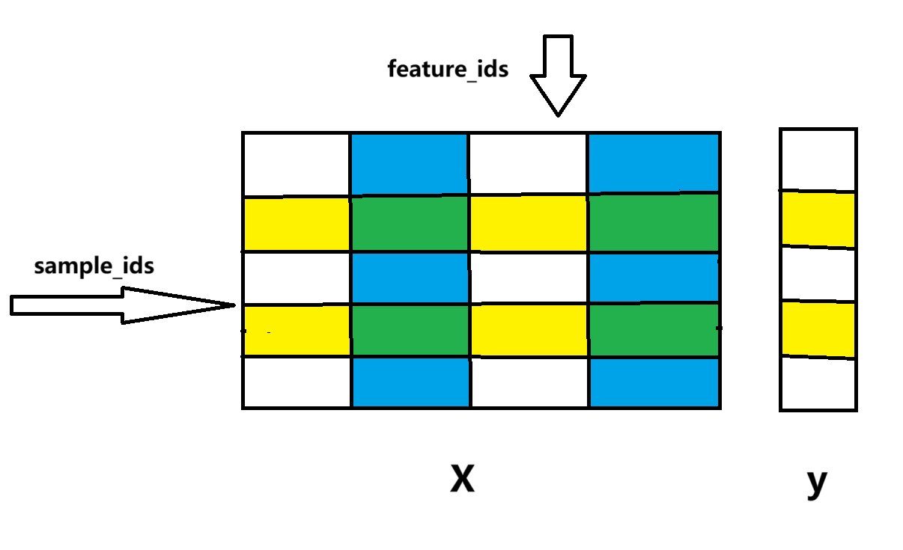
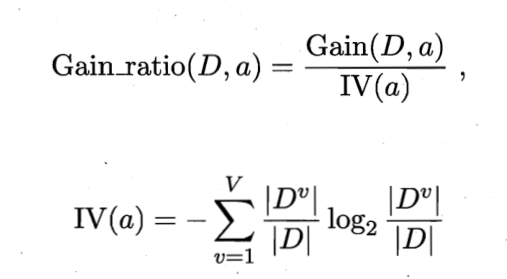
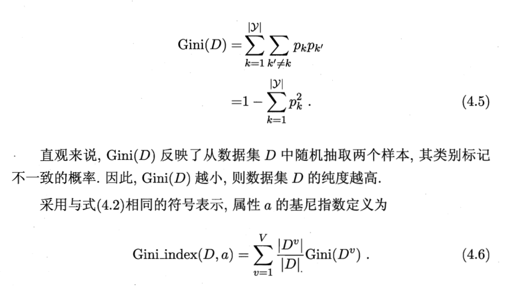

# 从零开始手写一棵决策树分类器

## How to start

```bash
pip install -r requirements.txt
```

```bash
python main.py
```

## 项目结构

- `datasets`: 数据集存放目录
    - 数据集：鸢尾花，乳腺癌，西瓜书中的 melon2, melon3, melon3alpha
- `out`: 最终生成的可视化决策树图片存放目录
- `data_class`: 对传入的数据进行一个整合处理，方便后续树的构建
  - `RealData.py`: 存放 `RealData` 类，保存的是真实的所有数据
    - 数据格式：特征与标签分开存储，特征向量的 `shape` 为 [n_samples, n_features]
  - `DataIndex.py`: 存放 `DataIndex` 类, 保存的是真实数据的索引，通过索引的方式映射出拆分的子数据集
    - 数据格式：
      - 样例维度索引列表 `smple_ids`, 相当于 `i`
      - 特征维度索引列表 `features_ids`, 相当于 `j`
  - `utils.py`: 构建 data 的工具函数集合
    - `from_`字段：从对应数据结构中生成 `RealData`
    - `build_index`: 为一个新的 `RealData` 构建一个全索引
    - `split_`字段: 对数据按照给定的方式进行拆分
- `utils`: 存放相关公式建立的目录
  - `evaluate.py`: 包含西瓜书上相关评估特征选取方面上的函数
  - `chose_best.py`: 根据不同的评估方式选取最优的特征及特征取值(连续值特有)
  - 为了方便后续参数的统一, 在离散特征选取函数的返回值后面添加了无意义的`None`用于与连续值情况对齐
- `tree`: 决策树构建目录
  - `TreeNode.py`: 存放 `TreeNode` 类, 保存的是树结点
  - ` DecisionTreeClassifier.py`: 决策树分类器
  - `visual.py`: 通过 `graphviz` 包画出决策树
- `main.py`: 主函数入口



## 相关公式及算法
来源于西瓜书的决策树章节

- 交叉熵


- 信息增益


- 增益率



- 基尼指数



- 决策树构建算法

